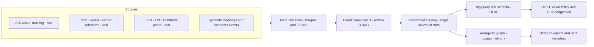

# Ocean Freight Forwarder — Data Architecture (MSDS 683)

An end-to-end data architecture for a **freight forwarder / 3PL** operating in **global ocean container logistics**. Multi-source, multi-format maritime data (real AIS vessel tracking + port/vessel/carrier reference + trade-flow priors, augmented with synthetic bookings and container events) flows through a **GCP pipeline** into a **hybrid analytical layer**: a **BigQuery star-schema warehouse** for OLAP/dimensional analytics and an **ArangoDB property graph** for network/relationship analytics.

> **Course deliverable for MSDS 683 (Data Architecture)** — a 3-person group project graded on translating a domain into a data model, making and *defending* schema-design decisions, implementing at least one cloud ETL process, orchestrating with Airflow, and demoing it. Also the design foundation for the **MSDS 681 (Data Lakehouse)** build next term.

## Core value

The architecture answers four freight-forwarder analytical questions through the **right store per workload** — proving the hybrid design is *justified, not incidental*:

| # | Use case | Served by |
|---|----------|-----------|
| UC1 | ETA reliability (schedule delta vs. proforma) | BigQuery star (OLAP) |
| UC2 | Port congestion / dwell over time | BigQuery star (OLAP) |
| UC3 | Chokepoint exposure (Suez / Panama / Malacca) | ArangoDB graph (network) |
| UC4 | Rerouting / alternative-path analysis | ArangoDB graph (network) |

## Architecture at a glance

The two stores are kept in sync from **one conformed staging layer**: the same deterministic business keys (UN/LOCODE, IMO, SCAC) are the BigQuery dimension natural keys *and* the ArangoDB `_key`s — which is what lets a graph result join back to a warehouse fact in the demo.

## Design docs (the deliverables)

All design is captured as **deck-source Markdown** in [`docs/deck/`](docs/deck) (these are the source of truth for slides in the shared Google Slides deck). The Mermaid diagrams render directly on GitHub.

### M2 — ER, Dimensional & Graph Design (current)
| Doc | What it covers | Requirements |
|-----|----------------|--------------|
| [m2-er-logical.md](docs/deck/m2-er-logical.md) | Logical ER diagram (10 entities) + fact/dimension classification | MOD-01, MOD-02 |
| [m2-bq-star.md](docs/deck/m2-bq-star.md) | BigQuery star: per-fact grains, conformed dims, SCD strategy, partition/cluster | MOD-03, MOD-04 |
| [m2-star-vs-snowflake.md](docs/deck/m2-star-vs-snowflake.md) | Defended star-over-snowflake rationale (columnar economics) | MOD-05 |
| [m2-arango-graph.md](docs/deck/m2-arango-graph.md) | ArangoDB property-graph model, named graph `ocean_network` | MOD-06 |
| [m2-conformed-keys.md](docs/deck/m2-conformed-keys.md) | Conformed-key bridge (UN/LOCODE · IMO · SCAC) + hybrid justification | MOD-07 |
| [m2-gap-analysis.md](docs/deck/m2-gap-analysis.md) | Data-needs-vs-available-sources reconciliation | MOD-08 |

### M1 — Domain & Dataset Lock
| Doc | What it covers |
|-----|----------------|
| [m1-team-domain.md](docs/deck/m1-team-domain.md) | Team name, members, chosen domain |
| [m1-use-cases.md](docs/deck/m1-use-cases.md) | The four analytical use cases |
| [m1-source-inventory.md](docs/deck/m1-source-inventory.md) | Data sources, access-verified, with the bounded AIS scope |
| [m1-real-vs-synthetic.md](docs/deck/m1-real-vs-synthetic.md) | Real-vs-synthetic data strategy |
| [m1-billing-guard.md](docs/deck/m1-billing-guard.md) | GCP billing budget + alert |

## Tech stack

| Layer | Choice |
|-------|--------|
| Raw landing | **GCS** (Hive-style date partitioning; Parquet for tabular, JSONL for events) |
| Orchestration | **Cloud Composer 3** running **Airflow 3** |
| OLAP store | **BigQuery** — native tables, star schema, partitioned + clustered |
| Graph store | **ArangoDB 3.12 Community Edition** (single node) |
| Graph analytics | **AQL** traversals/pathfinding + client-side **NetworkX / nx-arangodb** (Pregel was removed in 3.12) |
| Synthetic data | **Faker** (seeded) + **NumPy** `default_rng` + **pandas/pyarrow** |

See [`CLAUDE.md`](CLAUDE.md) for the full prescriptive stack, version pins, and the "what NOT to use" rationale.

## Milestones

1. **M1 — Domain & Dataset** ✅
2. **M2 — Domain Model** ✅ (ER + dimensional + graph design)
3. **M3 — Midterm Design Pitch** — ~7 min presentation
4. **M4 — GitHub Repo** — repo + contents checklist (this repo)
5. **Final** — ~10 min presentation with a working demo

## Repo notes

- `docs/deck/` holds the design deliverables; `scripts/` holds verification helpers.
- Bulk sample data, credentials, and GSD planning artifacts are intentionally **not** committed (see `.gitignore`).
