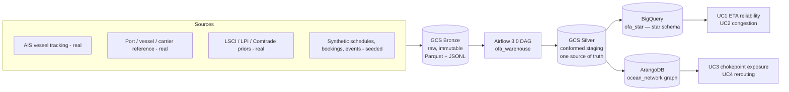
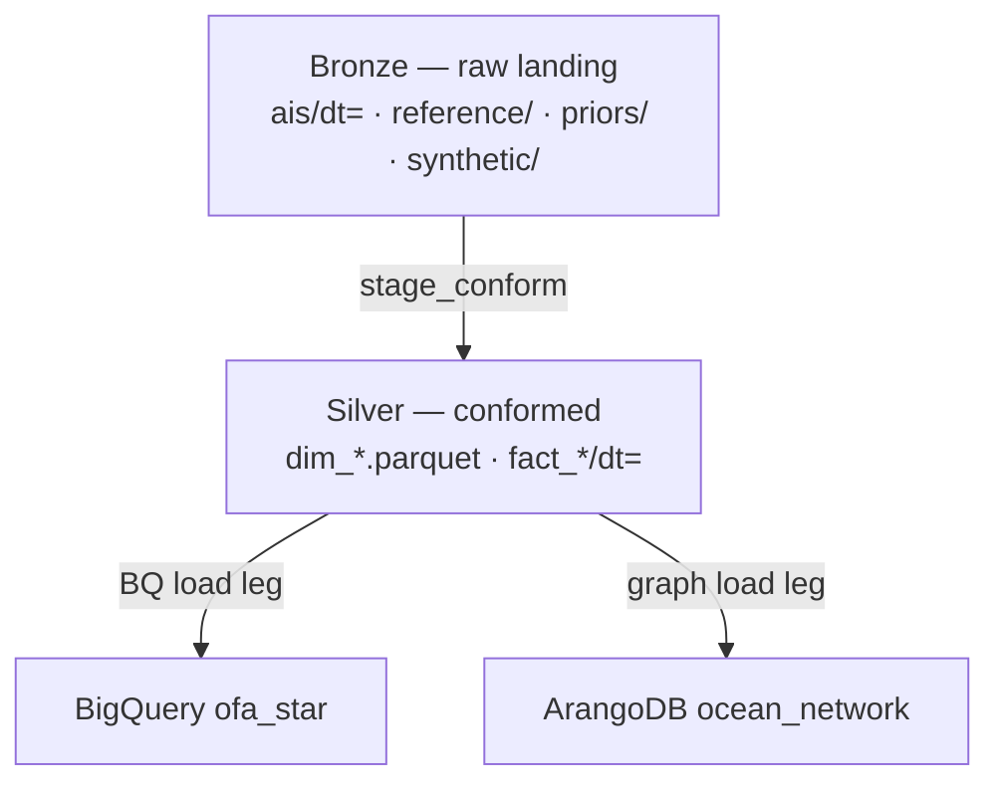
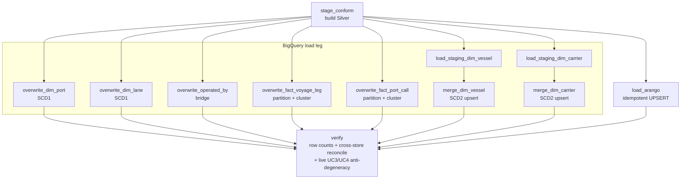
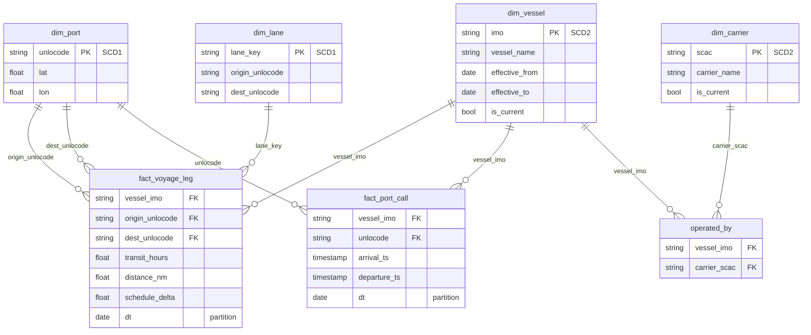
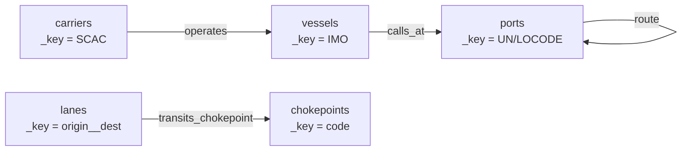
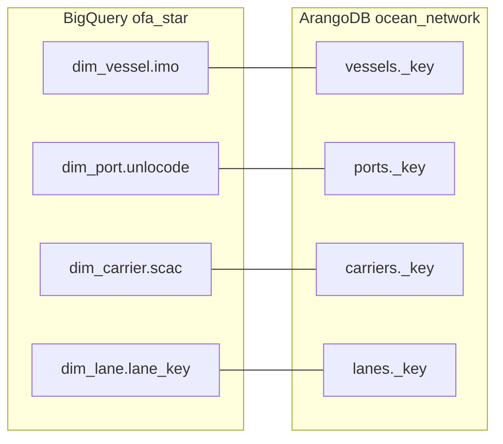

# Ocean Freight Forwarder — Data Architecture (MSDS 683)

An end-to-end data architecture for a freight forwarder / 3PL in global ocean container
logistics. Real maritime data (AIS vessel tracking, port/vessel/carrier reference,
trade-flow priors) plus seeded synthetic events flow through a GCP pipeline into two
analytical stores: a **BigQuery star-schema warehouse** for OLAP questions and an
**ArangoDB property graph** for network questions. Each of the four use cases runs on
whichever store fits the workload.

> Group project for **MSDS 683 (Data Architecture)**, 3 people. Graded on turning a domain
> into a data model, making and defending schema decisions, building at least one cloud ETL
> process, orchestrating it with Airflow, and demoing it. It also seeds the **MSDS 681 (Data
> Lakehouse)** build next term.

## The four use cases

| # | Question | Store | Why that store |
|---|----------|-------|----------------|
| UC1 | ETA reliability — actual vs. proforma schedule delta | BigQuery | Aggregation over a partitioned fact; columnar scan |
| UC2 | Port congestion / dwell over time | BigQuery | Time-series rollup on a date-partitioned fact |
| UC3 | Chokepoint exposure (Suez / Panama / Malacca …) | ArangoDB | Centrality + reachability over the route network |
| UC4 | Rerouting / alternative-path analysis | ArangoDB | Weighted shortest-path traversal |

OLAP questions run on the warehouse and network questions run on the graph. The same
business keys join a graph result back to a warehouse fact.

## Architecture



Both stores are built from one conformed Silver layer. The business keys (UN/LOCODE for
ports, IMO for vessels, SCAC for carriers) serve as both the BigQuery dimension natural
keys and the ArangoDB `_key`s, so a graph traversal result lines up 1:1 with a warehouse
row.

### Medallion layers



## Orchestration — the `ofa_warehouse` DAG

This project runs **plain Apache Airflow 3.0**, not Cloud Composer. The DAG uses only
standard operators so it stays Composer-portable (decision D-01): it runs locally with
`airflow dags test` today and lifts onto Cloud Composer 3 unchanged if the project moves to
managed Airflow. One conform step produces Silver. The BigQuery and ArangoDB load legs run
in parallel off that Silver, and `verify` fans in only after both stores finish.



`verify` fans in on both legs because the cross-store checks can only run once BigQuery and
ArangoDB are both populated. A half-loaded store can't pass or fail the gate by accident.

## Schema design

### BigQuery star schema (`ofa_star`)

Two date-partitioned, clustered facts surrounded by flat conformed dimensions. We use a
star rather than a snowflake: on a columnar engine storage is cheap and joins are the cost,
so normalizing dimensions to save space is the wrong trade (full rationale in
[`docs/deck/m2-star-vs-snowflake.md`](docs/deck/m2-star-vs-snowflake.md)).



DDL is in [`sql/ddl_star.sql`](sql/ddl_star.sql); the SCD2 dimension upserts are
[`sql/merge_dim_vessel.sql`](sql/merge_dim_vessel.sql) and
[`sql/merge_dim_carrier.sql`](sql/merge_dim_carrier.sql). Facts partition on `dt` and cluster
on the foreign keys queried most.

### ArangoDB graph (`ocean_network`)

Five vertex collections, four edge collections, one named graph. The model is fixed in
[`docs/deck/m2-arango-graph.md`](docs/deck/m2-arango-graph.md).



### Conformed-key bridge

The same key identifies a thing in both stores, so the two halves share one identity space.



## Data sources

| Source | Real / synthetic | Format | What it gives us |
|--------|------------------|--------|------------------|
| AIS vessel tracking (MarineCadastre) | Real | GeoParquet | Vessel positions → port calls and voyage legs |
| Port / vessel / carrier reference (UN/LOCODE, World Port Index) | Real | CSV → Parquet | Dimension attributes, geocoding |
| Trade-flow priors (UNCTAD LSCI, World Bank LPI, UN Comtrade) | Real | JSON/CSV | Condition the synthetic lane network |
| Schedules, bookings, container events | Synthetic (seeded) | JSONL | Proforma timing, booking/event volume |
| Lane network + chokepoint assignments | Synthetic (curated) | constants | The route graph and chokepoint transits |

**Real vs. synthetic.** AIS and reference data are real but bounded to a defensible slice
(Q1 2024, four US ports: Houston, LA, NYC, Savannah) to keep scan cost and graph size in
check. The booking/event/schedule layer and the foreign-port lane network are synthetic, since
no single public feed carries a forwarder's bookings end to end. We generate them
deterministically so any teammate reproduces byte-identical output. Generators are seeded
with `numpy.random.default_rng` and a pinned Faker version, and the contract is recorded in
[`synthetic.sha256`](synthetic.sha256). `samples/` holds small proof-of-pull extracts from
each real source so the sourcing is visible without committing bulk data.

## How to run

Everything runs through `make`. Targets shell to `python -m <module>` or to `bq` / `airflow`.

```bash
# 1. Install (Python 3.11/3.12). Airflow installs via its constraints file.
pip install -e .[dev]

# 2. Credentials. Copy the template and fill in the real (gitignored) .env.
cp .env.template .env        # GCP via ADC; ARANGO_* point at the managed cluster

# 3. Bronze — pull real sources, generate synthetic, land in GCS, verify.
make bronze                  # = pull-reference pull-priors pull-ais generate load-bronze verify

# 4. Silver — conform + derive the staging layer, verify.
make silver                  # = conform derive verify

# 5. Warehouse — create the star schema, load it, verify.
make warehouse               # = ddl load-bq verify   (runs the DAG via `airflow dags test`)

# 6. Graph — load the ArangoDB named graph.
make load-arango

# 7. Freeze the four UC answers and run the demo notebook end-to-end.
make freeze
make demo
```

Useful focused targets:

| Target | What it does |
|--------|--------------|
| `make verify` | Full ship-gate ladder (Bronze → Silver → BQ → cross-store → UC) |
| `make verify-uc` | Live UC3/UC4 anti-degeneracy check against the ArangoDB cluster |
| `make verify-cluster` | Connectivity + load smoke test against the cluster |
| `make secret-gate` | No-committed-secrets scan (same check CI runs) |

## Current state

Design and a working vertical slice are both done.

- **M1 Domain & dataset** — locked.
- **M2 Domain model** — ER, dimensional, and graph design complete (see `docs/deck/`).
- **Pipeline** — Bronze ingestion, Silver conform/derive, BigQuery star load, and ArangoDB
  graph load all run; the `ofa_warehouse` DAG wires them with a fan-in `verify`.
- **Demo** — all four UCs answer; `docs/demo.ipynb` runs from a clean clone against frozen
  golden snapshots, so the demo holds with no live credentials.
- **Next** — M3 midterm pitch and the final demo.

## Tech stack

| Layer | Choice |
|-------|--------|
| Raw + staging | GCS, Hive-style date partitioning; Parquet for tabular, JSONL for events |
| Orchestration | Plain Apache Airflow 3.0, Composer-portable (D-01) |
| OLAP store | BigQuery — native tables, star schema, partitioned + clustered |
| Graph store | Managed ArangoDB 3.12 cluster |
| Graph analytics | AQL traversal / `SHORTEST_PATH` + Graph Analytics Engine (GAE) server-side; NetworkX is the fallback |
| Synthetic data | Faker (pinned) + NumPy `default_rng` + pandas/pyarrow |

Full prescriptive stack, version pins, and the "what not to use" rationale live in
[`CLAUDE.md`](CLAUDE.md).

## Repo layout

| Directory | Purpose |
|-----------|---------|
| `ingest/` | Real-source pulls — AIS, reference, priors |
| `data_gen/` | Seeded synthetic generators — schedules, bookings, container events, lane network |
| `silver/` | Conform + derive: identity resolution, geofencing, dims, facts |
| `sql/` | BigQuery DDL, SCD2 merges, UC1/UC2 query SQL |
| `aql/` | ArangoDB queries for UC3/UC4 (with `.explain` plans) |
| `analytics/` | UC3/UC4 runners, criticality, snapshot builders |
| `lib/` | Shared clients + loaders — GCS, ArangoDB, graph loader/queries |
| `dags/` | The `ofa_warehouse` Airflow DAG |
| `scripts/` | Bronze landing, verify ship-gates, UC freeze, demo build |
| `tests/` | pytest suite (conform, derive, geofence, graph load, cross-store, DAG) |
| `docs/` | Design deck source (`deck/`), demo notebook, run-from-clone guide |
| `reference/` | Small committed reference tables (e.g. chokepoints) |
| `samples/` | Proof-of-pull extracts from each real source |
| `web/` | Next.js demo app (live BigQuery with golden fallback) |

## Design docs

Design lives as deck-source Markdown in [`docs/deck/`](docs/deck) (source of truth for the
shared Google Slides deck; the Mermaid renders on GitHub).

| Doc | Covers |
|-----|--------|
| [m2-er-logical.md](docs/deck/m2-er-logical.md) | Logical ER + fact/dimension classification |
| [m2-bq-star.md](docs/deck/m2-bq-star.md) | Star: grains, conformed dims, SCD, partition/cluster |
| [m2-star-vs-snowflake.md](docs/deck/m2-star-vs-snowflake.md) | Defended star-over-snowflake rationale |
| [m2-arango-graph.md](docs/deck/m2-arango-graph.md) | Property-graph model, named graph `ocean_network` |
| [m2-conformed-keys.md](docs/deck/m2-conformed-keys.md) | Conformed-key bridge + hybrid justification |
| [m2-gap-analysis.md](docs/deck/m2-gap-analysis.md) | Data-needs vs. available-sources reconciliation |

M1 docs (`m1-team-domain.md`, `m1-use-cases.md`, `m1-source-inventory.md`,
`m1-real-vs-synthetic.md`, `m1-billing-guard.md`) are in the same folder.

## M4 GitHub checklist

### Tier 1 — must-have

| Item | Status | Note |
|------|--------|------|
| README (what / data source / how to run / state) | Yes | This file |
| Data ingestion — script or notes | Yes | `ingest/` + the `make bronze` flow |
| Transformation scripts | Yes | `silver/` (conform/derive), `sql/`, `aql/` |
| No secrets/credentials committed | Yes | `.env` gitignored; `.env.template` only; `make secret-gate` + CI |
| Schema design visible in the repo | Yes | `sql/ddl_star.sql`, `docs/deck/m2-*`, diagrams above |

### Tier 2 — good practice

| Item | Status | Note |
|------|--------|------|
| Dependencies / config / env files | Yes | `pyproject.toml`, `.env.template`, `Makefile` |
| Commit history shows incremental work | Yes | Per-phase TDD commits (RED → GREEN → golden) |
| Note on data source / sample-data approach | Yes | "Data sources" section + `samples/` |
| Folder structure separates code by purpose | Yes | "Repo layout" section |

Tier 3 (aspirational) is largely present already — orchestration DAG (`dags/`), automated
data-quality gates (`scripts/verify.py`), CI (`.github/workflows/`), and ADRs — but it is
out of scope for this checklist pass.
