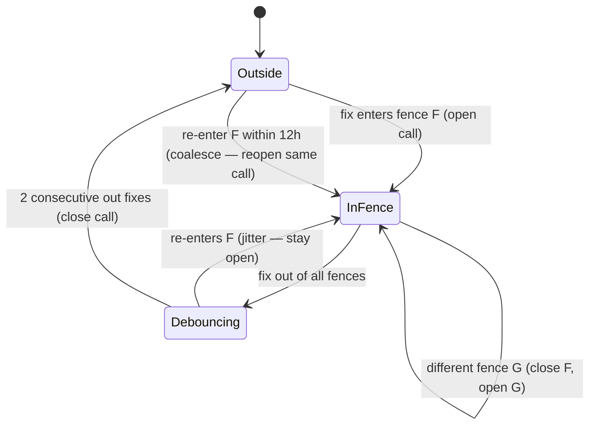

# Final Presentation & Demo — Slide Source (Grilled Cheesin)

> **Manual step:** this file is the repo-side source of truth. Paste each **Slide content** block
> into the *Final* section of the single shared Google Slides deck — **do not create a new deck**
> (rubric rule). The **Say / defense** notes are speaker notes / Q&A prep.
>
> **What changed in the brief** (per `docs/Project plan.pdf` — the latest "Project plan (3).pdf"):
> 1. Recap is now brief — the audience already knows the domain/schema.
> 2. **Airflow orchestration is no longer required** — it now counts only as **bonus**. We built it,
>    so we present it as bonus, not as the spine of the talk.
> 3. In exchange, the **demo must end in a concrete, consumable output** — for us that is the
>    **`web/` Next.js dashboard** (maps + charts a non-technical user reads), not data sitting in a DB.
>
> **Numbers note:** all figures are transcribed from the committed frozen goldens
> (`data/golden/uc{1,2,3,4}.golden.json`, frozen 2026-06-16) — they reproduce the live gate-19
> non-degeneracy proof, not remembered literals.

---

## Time & grading map (keep in view)

~10 min + Q&A. The brief grades on (60 pts):

| Section | Slides | Rubric line | Pts |
|---|---|---|---|
| 1. Quick recap (~30s) | F-1 | — | — |
| 2. Schema — what changed (~30s) | F-2 | Schema changes clearly explained | 5 |
| 3. Pipeline → end-product demo (~5 min) | F-3 … F-7 | Transformations are business logic + ≥1 demoed (15) · End product is consumable (10) | 25 |
| 4. Tech stack (1–2 min) | F-8 | Tech stack appropriately justified | 10 |
| 5. Budget & cost model (1–2 min) | F-9 | Realistic budget with stated assumptions | 5 |
| — Presentation clarity & demo quality | (all) | — | 15 |
| 6. Bonus (+1–2 min) | F-10 | Airflow orchestration (bonus) | +bonus |

**Where the 5 minutes go:** spend them on **F-4/F-5 (the geo-fence event path)** and **F-6 (edge
weights → reroute)**, then land on **F-7 (the dashboard)**. Everything else is fast.

---

# FINAL — Presentation & Demo (10 slides)

## Slide F-1 — Quick recap *(~30s)*

**Slide content**
- **Team:** Grilled Cheesin — P.J. Losiewicz · Borna Karimi · Alexander Mohun
- **Domain:** end-to-end data architecture for an **ocean freight forwarder / 3PL**.
- **Business question:** which lanes, ports, and chokepoints put our customers' shipments at risk —
  and what does a disruption *cost in transit time*?
- **Answer shape:** a **hybrid** analytical layer — a **BigQuery star warehouse** for the OLAP
  questions (UC1 ETA reliability, UC2 port congestion) and an **ArangoDB property graph** for the
  network questions (UC3 chokepoint exposure, UC4 rerouting). Right store per workload.

**Say / defense**
- One line: "the four questions don't all want the same database — roll-ups go to the columnar
  warehouse, reachability/shortest-path goes to the graph, and shared business keys make it *one*
  architecture." Move on fast — they already know this.

---

## Slide F-2 — Schema: what changed *(~30s)*

**Slide content**
- **Core star + graph schema: unchanged since the midterm.** Two date-partitioned, clustered facts
  (`fact_voyage_leg`, `fact_port_call`) around flat conformed dimensions; the `ocean_network` graph
  is 5 vertex + 4 edge collections.
- **One refinement worth naming:** we added the **`chokepoints` vertex + `transits_chokepoint`
  edge** and a `lane_key` attribute on every `route` edge, so a chokepoint **closure** resolves to
  the exact route edges that transit it. That's what makes UC3/UC4 *executable*, not just drawable.
- **Star over snowflake — still the defended call** (columnar engine: storage is cheap, joins are
  the cost). Rationale in [`m2-star-vs-snowflake.md`](m2-star-vs-snowflake.md).

**Say / defense**
- "Schema is stable. The only meaningful change since the pitch is the chokepoint sub-graph, which
  turned UC3/UC4 from a diagram into a query that returns a number."

---

## Slide F-3 — The pipeline, end to end *(~45s — sets up the deep dive)*

**Slide content** — one real path, Bronze → Silver → Gold → product:

```
 RAW SOURCE            BRONZE  (land as-is)        SILVER  (conform + DERIVE)          GOLD  (serve)             PRODUCT
 ──────────            ───────────────────────     ────────────────────────────       ───────────────────       ──────────────
 AIS positions ──────▶ immutable Parquet,      ──▶ MMSI→IMO identity resolve,      ┌─▶ BigQuery star          ┌─▶ Next.js
 (MarineCadastre)      partitioned by dt=          GEO-FENCE → port-calls,         │   fact_voyage_leg /      │   dashboard
 WPI / UN/LOCODE   ──▶ reference tables           derive VOYAGE LEGS,             │   fact_port_call         │   (maps +
 LSCI/Comtrade/LPI ──▶ trade-flow priors          conform keys + provenance ──────┤                          ├─▶ charts a
 synthetic gen     ──▶ JSONL events               EDGE WEIGHTS from priors        └─▶ ArangoDB graph         │   PM reads)
                                                                                       ocean_network          └─▶ live SQL/AQL
```

- **Today we walk ONE real path end to end:** **raw AIS positions → geo-fenced port-calls and
  voyage-legs → both Gold stores → the dashboard.** (Representative subset, not the full volume —
  Q1 2024, 4 US ports, ~1.88M position rows.)
- **One transform, two sinks:** both Gold stores read the *same* conformed Silver — they never read
  each other — so a shared-key metric reconciles by construction.

**Say / defense**
- "I'm going to show you the part that's genuinely hard: turning raw lat/lon pings into *events*
  (port calls), and turning real trade indices into *edge weights* on the route graph. Then I'll
  point the dashboard at the result."

---

## Slide F-4 — Transform deep-dive ①: geo-fencing raw AIS into events *(~1.5 min — core)*

**Slide content** — `silver/geofence.py` + `silver/haversine.py`

- **Input (Bronze):** AIS position fixes — `(resolved IMO, WKB point, timestamp)`. Nothing else;
  we deliberately **never** trust the AIS free-text "destination" field.
- **The geometry:** a port "geofence" is a **circle** — a radius around each port's WPI lat/lon
  centroid. A fix is *in-fence* iff `haversine_nm(fix, port) ≤ radius`. (`haversine_nm` is ~10 lines
  of stdlib `math`; error vs. true geodesic <0.5% — not worth a geo dependency.)
- **The event rule (state machine, per vessel, in time order):** a **port call** = a vessel
  *entering* a fence and *dwelling* continuously ≥ a minimum threshold.
  - **arrival** = first in-fence fix · **departure** = last in-fence fix before a *sustained* exit.
  - **debounce (= 2 fixes):** one stray out-of-fence ping between in-fence pings is still "inside" —
    a vessel jittering across the 5 nm boundary is **one** call, not many.
  - **fence switch:** a fix inside a *different* fence can't be jitter (you can't be in two 5 nm
    circles at once) → close call A, open call B immediately.
  - **re-entry coalesce (≤ 12 h):** drift out and back into the *same* fence (berth shift / AIS gap)
    re-opens the same call instead of spawning a spurious second one.
- **Tunable, documented defaults:** `radius = 5 nm`, `min-dwell = 1 h`, `debounce = 2`,
  `reentry-gap = 12 h` — all parameters, so they're calibratable and defensible.



**Say / defense**
- "Why a state machine instead of a `GROUP BY port`? Because an *event* is temporal — it's defined
  by entry, continuous dwell, and a sustained exit. A naive group-by would split one messy call into
  five and invent zero-distance voyage legs. The debounce and the re-entry coalesce are exactly the
  fixes for real-world AIS noise."
- "Why circular fences not polygons? Centroid + radius is one cheap haversine per fix; harbour
  polygons would need a geometry engine for <0.5% gain at this scale."

---

## Slide F-5 — Transform deep-dive ②: events → the two real facts *(~1 min — core)*

**Slide content** — `silver/derive.py` (pure, offline-testable; no I/O)

- **`derive_fact_port_calls`** → one `fact_port_call` row per geo-fenced call: attaches the conformed
  `dim_port` centroid lat/lon (from the dimension, *not* AIS text), partitions by **arrival date**,
  tags `provenance="real"`.
- **`derive_voyage_legs`** → pairs each vessel's *consecutive* calls A→B into one `fact_voyage_leg`:
  - `transit_hours = (B.arrival − A.departure)`
  - `distance_nm = haversine(centroid_A, centroid_B)` (great-circle)
  - `schedule_delta = actual − proforma` **only** where a synthetic proforma lane matches, else
    `NULL` — the honest real/synthetic seam; we do not fabricate a schedule.
- **Edge-case discipline (business rules, not accidents):** a single-call vessel → **zero** legs;
  same-port consecutive calls (origin == dest) are a re-entry, **not** a transit → excluded, so no
  zero-distance junk leg ever pollutes the fact.

| `fact_voyage_leg` (grain: one inter-port transit) | source |
|---|---|
| `vessel_imo`, `origin_unlocode`, `dest_unlocode` | resolved keys |
| `transit_hours` | event timestamps |
| `distance_nm` | haversine over centroids |
| `schedule_delta` | actual − proforma (NULL if unmatched) |
| `dt` (partition) | origin-departure date |
| `provenance` | `real` |

**Say / defense**
- "This is where the 15 transformation points live: the facts are defined by *business logic*
  — what a port call is, what a voyage leg is, when a schedule delta is even meaningful — and every
  rule is in version-controlled, unit-tested pure functions (`tests/test_geofence.py`,
  `tests/test_derive.py`)."

---

## Slide F-6 — Transform deep-dive ③: the edge-weight logic *(~1.5 min — core)*

**Slide content** — `data_gen/conditioning.py` → `lib/graph_loader.py` → `aql/uc4_reroute_shortest_path.aql`

The route graph isn't invented — its **edge weights are *derived from real trade indices*** (there
is no free public bilateral port-pair feed, so we condition synthetic structure on real priors):

- **Lane plausibility** (which port-pairs carry service, how much demand):
  `lane_weight(A,B) = norm(LSCI[country A]) × norm(LSCI[country B]) × norm(Comtrade[A→B])`
  (each factor divide-by-max normalized to [0,1]; degenerate priors guarded to stay finite).
  - *LSCI* = UNCTAD Liner Shipping Connectivity Index · *Comtrade* = UN bilateral trade flow.
- **Reliability / delay baseline** (per country, from World Bank **LPI**):
  `expected_delay_hours(c) = 72h × (max_LPI − LPI[c]) / (max_LPI − min_LPI)` — monotonic-decreasing
  in LPI (a more reliable logistics environment → lower expected delay); feeds a **seeded** numpy
  lognormal draw so per-leg delays are reproducible.
- **The four route-edge weights** projected onto each `route` edge (`build_route_edge`):
  `distance_nm` (haversine over centroids) · `transit_time_hours = distance_nm / 18 kn` (typical
  container service speed) · `service_frequency` (LSCI) · `reliability_score` / `expected_delay` (LPI).
- **Provenance on weights too:** a weight is tagged `real` only when overlaid from an observed
  `fact_voyage_leg` (US→US only — that's all the AIS slice can see); everything else is
  `synthetic`. Same honesty discipline as the facts.

**Then the weight does work — UC4 reroute** (`K_SHORTEST_PATHS`, weighted by `transit_time_hours`):

| Scenario | Path | Hours |
|---|---|---|
| Baseline USNYC → CNSHA | direct | **355.97 h** |
| SUEZ closed (disable transiting lanes, re-run) | USNYC → **USLAX** → CNSHA | **432.19 h** |
| **Reroute cost** | detours via USLAX | **+76.22 h** |

**Say / defense**
- "When the grader asks 'where's your route table?' — *here*. We don't have a magic bilateral lane
  feed, so we **condition** synthetic lanes on three real indices (LSCI, Comtrade, LPI) and document
  it as a prior, never promoted to a fact."
- "Why `K_SHORTEST_PATHS` not plain `SHORTEST_PATH`? A bare shortest-path computes the optimum first
  and filters disabled lanes *after* — so closing the best lane returns *empty*, not a detour. K-shortest
  enumerates by increasing weight; we keep the cheapest path that avoids the closed chokepoint, so the
  reroute is a genuine, strictly-positive-delta detour."

---

## Slide F-7 — End product: the dashboard *(~1 min — the consumable output)*

**Slide content** — `web/` (Next.js 16, deployed on Vercel)

- **What a non-technical user sees:** four pages (`/uc1`–`/uc4`) — UC1/UC2 as KPI tables + trend
  **charts** (recharts) off the BigQuery star; UC3/UC4 as an **interactive map** (deck.gl + MapLibre)
  showing chokepoints, transit share, and the live **reroute path** when a chokepoint is "closed."
- **Pointed straight at Gold:** server components read **live BigQuery** (`@google-cloud/bigquery`)
  and the **live ArangoDB cluster** (`arangojs`); with no credentials they fall back to the
  **frozen goldens**, so the demo renders top-to-bottom from a clean clone and **cannot fail live**.
- **The headline a PM reads off the screen:** "Closing Suez adds **+76 hours** to New York → Shanghai,
  rerouting via Los Angeles" — a number a customer-facing planner can act on.

**Say / defense**
- "This is the brief's 'concrete consumable output' — the pipeline output lands as a dashboard, not
  rows in a table. The map *is* the gold layer, rendered." (Show the UC3/UC4 page; toggle a closure.)
- Failure-proofing: a recorded backup exists (`docs/07-RECORD-BACKUP.md`); the live toggle is a
  *"look, it's real"* aside, never required to render.

---

## Slide F-8 — Tech stack *(1–2 min)*

**Slide content** — paste the diagram from
[`tech-stack/tech-stack-diagram.md`](tech-stack/tech-stack-diagram.md). One line per layer:

| Layer | Tool | Role in one line |
|---|---|---|
| Raw + staging | **GCS** | immutable Bronze + conformed Silver landing (Parquet/JSONL, `dt=` partitioned) |
| OLAP store | **BigQuery** | star-schema warehouse — UC1/UC2 roll-ups (partitioned + clustered) |
| Graph store | **ArangoDB** (managed cluster) | `ocean_network` property graph — UC3/UC4 traversal + `K_SHORTEST_PATHS` |
| Orchestration (bonus) | **Apache Airflow 3.0** | the `ofa_warehouse` DAG: one conform → two parallel load legs → fan-in verify |
| Transforms / glue | **Python 3.11** | the conform/derive/geofence/conditioning logic |
| Tabular + format | **pandas + pyarrow** / **Parquet + JSONL** | shape dims/facts; columnar tabular, JSONL for evolving events |
| Synthetic data | **NumPy `default_rng` + Faker** (seeded/pinned) | reproducible delays, volumes, identifiers |
| Graph driver | **python-arango** | idempotent `UPSERT` loader from the same Silver |
| End product | **Next.js + deck.gl + Vercel** | the consumable dashboard over live BQ/Arango |

> **Per-tool justification + alternatives** (for the "why this tool / what alternatives" follow-up)
> live in **[`docs/deck/tech-stack/`](tech-stack/)** — one file per tool.

**Say / defense**
- The brief warns: *"I will ask about one of your tools, why you picked it, and what alternatives you
  considered."* Each tool's file has a ready answer; the headline defenses are: **BigQuery** (serverless
  columnar — star pays off, no cluster to run), **ArangoDB** (graph + we're an ArangoDB shop — author is
  an SE), **GCS** (the landing zone both BQ and Composer read natively), **star over snowflake**
  (joins cost more than storage on columnar).

---

## Slide F-9 — Budget & cost model *(1–2 min)*

**Slide content** — assumptions stated, then the number.

**Course-scale today (bounded slice):** Q1 2024, 4 US ports, ~1.88M AIS rows (~a few GB Bronze),
graph ≤ ~100K edges. A **$50/mo GCP billing budget + alerts at 50/90/100%** is the live guard
(`docs/deck/m1-billing-guard.md`); actual spend sits well under it.

| Component | Driver | Course-scale est. | Production est. (assumptions below) |
|---|---|---|---|
| GCS storage | bytes landed | <1 GB → **~$0.02/mo** | 2 TB Bronze+Silver → **~$40/mo** |
| BigQuery storage | active table bytes | <2 GB → **~$0.04/mo** | 1 TB native, partitioned → **~$20/mo** |
| BigQuery query | bytes **scanned** | demo scans → **~$0/mo** (free tier) | 50 TB scanned/mo @ $6.25/TB → **~$310/mo** |
| ArangoDB cluster | managed instance hrs | team cluster (covered) → **~$0** | small prod cluster → **~$200–400/mo** |
| Airflow (Composer 3) | environment hrs | not run continuously → **~$0** | always-on small env → **~$300–450/mo** |
| Web (Vercel) | requests/bandwidth | hobby → **~$0** | Pro → **~$20/mo** |
| **Total** | | **≈ $0–5/mo (under the $50 cap)** | **≈ $900–1,250/mo (~$11–15K/yr)** |

**Production assumptions (stated):** full global AIS (not 4 ports), daily batch loads, ~50 TB/mo
scanned across BI users, an always-on Composer env, a small always-on Arango cluster.

**Say / defense**
- "The single biggest lever is **bytes scanned**, which is *why* we partition on `dt` and cluster on
  the FKs — partition pruning is the cost model, not an afterthought. The graph stays cheap because we
  bound it to a defensible slice. Today we're under $5/mo against a $50 cap; the production number is
  dominated by always-on compute (Composer + Arango), not storage."

---

## Slide F-10 — Bonus: orchestration with Airflow *(+1–2 min, optional)*

**Slide content**
- Airflow is now bonus — **we built it.** The `ofa_warehouse` **Airflow 3.0** DAG is the implemented
  cloud-ETL: `stage_conform` (build Silver) → **parallel** `load_bigquery` ∥ `load_arango` →
  **fan-in `verify`** (row counts + cross-store reconcile + live UC3/UC4 anti-degeneracy).
- **Plain Apache Airflow, Composer-portable:** standard operators only, runs locally via
  `airflow dags test`, lifts onto **Cloud Composer 3** unchanged.
- `verify` fans in on both legs so a half-loaded store can't pass the gate by accident.

**Say / defense**
- "Per the brief, orchestration is bonus now — but it's done. The reason it's *one* conform feeding
  *two* parallel loads is the 'one transform, two sinks' contract: that's what guarantees the
  warehouse and the graph are the same architecture, not two databases."

---

## Source-file map (where each slide's detail lives)

| Slide | Source |
|---|---|
| F-1 | `m1-team-domain.md`, `m1-use-cases.md` |
| F-2 | `m2-bq-star.md`, `m2-arango-graph.md`, `m2-star-vs-snowflake.md` |
| F-3 | `README.md` (architecture), `dags/ofa_warehouse_dag.py` |
| F-4 | `silver/geofence.py`, `silver/haversine.py` |
| F-5 | `silver/derive.py`, `sql/ddl_star.sql` |
| F-6 | `data_gen/conditioning.py`, `lib/graph_loader.py`, `aql/uc4_reroute_shortest_path.aql` |
| F-7 | `web/app/uc{1..4}/page.tsx`, `data/golden/uc*.golden.json` |
| F-8 | `tech-stack/tech-stack-diagram.md` + `tech-stack/*.md` |
| F-9 | `m1-billing-guard.md` |
| F-10 | `dags/ofa_warehouse_dag.py` |
