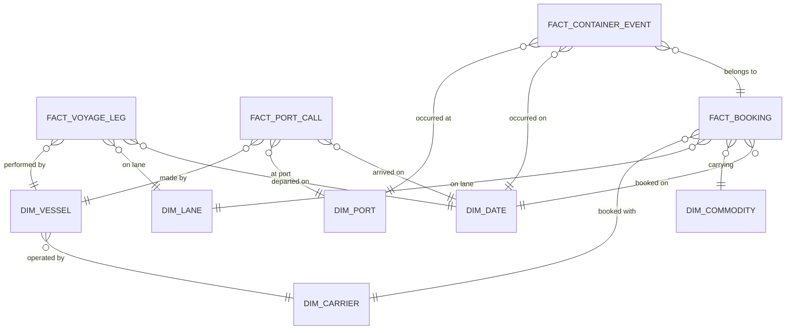
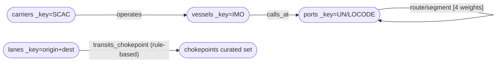

# M1 + M2 Slide Context — Grilled Cheesin

> **Purpose:** One consolidated, slide-ready brief distilled from the project brief
> (`docs/Project plan.pdf`) and the 11 repo source files in `docs/deck/`. Each section
> below maps to **one slide**. Copy the **Slide content** into the shared Google Slides deck;
> the **Defense / speaker notes** are what you say out loud or keep for Q&A.
>
> **Do not create a new deck** — all milestones live in the single shared deck (rubric rule).

---

## What the rubric is grading (keep this in mind per slide)

- **M1 — Domain & Dataset (10 pts):** team name (food-themed), member names, chosen domain,
  analytical question(s), and dataset sources.
- **M2 — Domain Model (10 pts):** ER diagram with **5–6+ entities** + relationship annotations,
  data-needs-vs-sources comparison, and an initial **fact vs. dimension** guess.
- Graders reward **defending** choices (star vs. snowflake, OLAP vs. OLTP), not just stating them.
- This design also seeds the **MSDS 681 Lakehouse** build next term — favor designs that extend.

---

# MILESTONE 1 — Domain & Dataset (5 slides)

## Slide M1-1 — Team & Domain

**Slide content**
- **Team:** Grilled Cheesin
- **Members:** P.J. Losiewicz · Borna Karimi · Alexander Mohun
- **Domain:** End-to-end data architecture for a **freight forwarder / 3PL** in **global ocean
  container logistics**.
- **One-liner:** A **hybrid analytical layer** — a **BigQuery star-schema warehouse** for
  OLAP/dimensional analytics and an **ArangoDB property graph** for network/relationship
  analytics — answering each question on the *right store per workload*.

**Defense / speaker notes**
- The forwarder/3PL lens gives the richest cross-source story: it touches carriers, ports,
  lanes, and risk simultaneously, and frames all four use cases coherently.
- Exercises three rubric axes deliberately: **scale**, **multi-source/multi-format**, and
  **temporal richness**.

---

## Slide M1-2 — Four Analytical Use Cases

**Slide content** (each question annotated with the store that answers it)

| # | Analytical question | Store |
|---|---------------------|-------|
| **UC1** | Which routes, carriers, and ports have the worst schedule reliability, and what drives the delays? | **BigQuery** (OLAP / star) |
| **UC2** | How do congestion and dwell time at key ports trend over time, and how do they ripple downstream? | **BigQuery** (temporal OLAP) |
| **UC3** | What share of shipments transit Suez, Panama, or Malacca, and what's the impact of a closure? | **ArangoDB** (graph reachability) |
| **UC4** | What is the best alternative routing when a lane is disrupted? | **ArangoDB** (graph pathfinding) |

**Defense / speaker notes**
- The OLAP/dimensional questions (UC1, UC2) live on the columnar warehouse; the
  network/relationship questions (UC3, UC4) live on the graph.
- **This split is what makes the hybrid defensible rather than incidental** — it is the thesis
  the whole architecture proves.

---

## Slide M1-3 — Source Inventory (access-verified)

**Slide content** — six real public sources, all access-verified by a **real pull** on
2026-06-13 (row/byte evidence recorded, not just a list of URLs):

| Source | Provider | Format | License |
|--------|----------|--------|---------|
| **MarineCadastre AIS** | NOAA/BOEM | Daily CSV (zip) | US-Gov public domain |
| **World Port Index** (Pub 150) | NGA | CSV (109 cols) | US-Gov public domain |
| **UN/LOCODE** | UNECE | CSV | UNECE terms (cite) |
| **UNCTAD LSCI** | UNCTAD / World Bank | JSON (SDMX) | Cite, no bulk redistribution |
| **World Bank LPI** | World Bank | JSON | Cite, no bulk redistribution |
| **UN Comtrade** | UN | JSON | Cite, no bulk redistribution |

**Defense / speaker notes**
- "Access verified" = a real pull with recorded evidence (e.g. AIS national day = **8.16M rows /
  877 MB**; filtered Houston cargo/tanker sample = **80,278 rows**).
- WPI carries **UN/LOCODE directly** (column 6) → no name/coordinate join needed to bridge to the
  conformed port key (resolved open question A3).
- **No API keys or billing IDs committed**; `samples/` and secrets are gitignored.
- **Known gap (defended):** there is **no free bilateral port-pair liner-service feed** — LSCI is
  country-level/per-port only. So LSCI/Comtrade are used as *priors*, not facts (see M1-4).

---

## Slide M1-4 — Real vs. Synthetic Data Strategy (three tiers)

**Slide content**

- **Tier 1 — REAL ground truth** (loaded as facts/reference): AIS positions → port-calls &
  voyage-legs; World Port Index attributes + lat/lon (UN/LOCODE); vessel reference (IMO);
  chokepoint nodes.
- **Tier 2 — REAL priors only** (conditioners, *not* stored as facts): UNCTAD LSCI (lane
  plausibility/frequency), UN Comtrade O-D (booking-volume weight), World Bank LPI (reliability
  baseline by country).
- **Tier 3 — SYNTHETIC** (deterministically generated): bookings, container/shipment events,
  proforma schedules, vessel→carrier operator assignments, lane structure beyond what AIS observes.

**Defense / speaker notes**
- **Every record carries a `real | synthetic` flag** from landing → conformance → demo, so the
  demo honestly distinguishes grounded vs. generated data at the row level.
- Synthetic volume is **scaled to the observed real AIS port-call count** (not arbitrary) →
  roughly thousands of bookings, tens of thousands of container events.
- "Where's your route table?" → there isn't a free one; the synthetic network is **conditioned by
  real per-port (LSCI) and per-lane (Comtrade) priors**. That *is* the point of the split.

---

## Slide M1-5 — GCP Billing Guard (credit safety)

**Slide content**
- **$50/month** budget cap on the GCP **billing account**, with alerts at **50% / 90% / 100%**.
- A budget is **metadata, free, provisions no compute** — set up **before any compute exists**.
- **No Cloud Composer** environment created until it's actually needed (and torn down when idle).
- Least-privilege: budget creation uses `billing.admin` only — **Owner is never granted**.

**Defense / speaker notes**
- Keeps the bounded AIS slice within the **$50/mo budget** and **ArangoDB CE 100 GiB cap**.
- Sets the credential-hygiene precedent early: billing-account ID read from env var, never
  hardcoded or committed.

---

# MILESTONE 2 — Domain Model (6 slides)

> **Locked entity set: 4 facts + 6 dimensions = 10 entities** — clears the 5–6-entity bar.
> Only `fact_voyage_leg` is *built* in the Phase-5 ETL slice; the other three facts are
> **designed now, implemented later** (they enrich the ER and carry the provenance narrative).

## Slide M2-1 — ER Diagram + Fact/Dimension Classification

**Slide content** — paste this Mermaid ER diagram (or an exported image of it):

**Fact vs. dimension (the initial classification the rubric asks for)**

| Entity | Type | Grain / role |
|--------|------|--------------|
| `fact_voyage_leg` | **fact** | One row per vessel per port-to-port leg (AIS-derived). UC1 source; **the implemented slice**. |
| `fact_port_call` | **fact** | One row per vessel call at a port (arrival→departure). UC2 source. Designed now, built later. |
| `fact_booking` | **fact** | One row per shipment booking. Synthetic. Designed now, built later. |
| `fact_container_event` | **fact** | One row per container milestone (gate-in/load/discharge/gate-out). Synthetic. |
| `dim_date` | dimension | Conformed calendar; static/immutable; shared by every fact. |
| `dim_port` | dimension | Port reference, keyed by **UN/LOCODE**; geo + harbor attributes. |
| `dim_vessel` | dimension | Vessel reference, keyed by **IMO** (MMSI = AIS join key only). |
| `dim_carrier` | dimension | ~10–15 major ocean carriers, keyed by **SCAC**. |
| `dim_lane` | dimension | Origin→destination port-pair; the warehouse twin of the graph `route` edge. |
| `dim_commodity` | dimension | Commodity reference (Comtrade HS-code taxonomy). |

**Defense / speaker notes**
- Classification is by `fact_*` / `dim_*` prefix (not Mermaid color — GitHub drops styling).
- Every fact carries a `provenance "real | synthetic"` column. Natural keys (`unlocode`, `imo`,
  `scac`, `hs_code`) are the conformed keys that also become ArangoDB `_key`s (slide M2-5).

---

## Slide M2-2 — BigQuery Star Schema (grains + SCD)

**Slide content**

- **Fact grains** (one sentence each):
  - `fact_voyage_leg` — one row per vessel per port-to-port leg. *Measures:* transit hours,
    distance, schedule delta (delay vs. proforma).
  - `fact_port_call` — one row per vessel call at a port. *Measures:* dwell, turnaround,
    anchorage/queue hours.
  - `fact_booking` — one row per booking. *Measures:* TEU, declared weight, freight amount.
  - `fact_container_event` — one row per container status event. *Measures:* sequence, hours
    since prior event.
- **SCD strategy:**
  - **SCD2 (history-tracked):** `dim_vessel` (operator/name/flag-state change),
    `dim_carrier` (alliance change / rebrand-merger). Columns: `scd2_effective_from`,
    `scd2_expiry_to`, `is_current`.
  - **SCD1 (overwrite):** `dim_port`, `dim_lane`, `dim_commodity`.
  - **Static:** `dim_date`.
  - **Deferred:** SCD2-on-`dim_port` → v2 / extra credit.
- **Physical:** native tables; **integer-range partitioned** on `*_date_sk` (YYYYMMDD);
  **clustered ≤4 keys per fact** (e.g. voyage_leg on `vessel_sk, lane_sk`; port_call on
  `port_sk, vessel_sk`).

**Defense / speaker notes**
- Every dimension has an `INT64` surrogate `<dim>_sk` PK **plus** a separate natural business key.
- Partition pruning on the date surrogate is the single biggest cost lever for the temporal use
  cases; the bounded one-quarter window stays well under BigQuery's 10,000-partition cap.

---

## Slide M2-3 — Star over Snowflake (the defended decision)

**Slide content**
- BigQuery is a **columnar MPP** engine: **storage is cheap, unused columns prune for free,
  joins are comparatively expensive** (they require data coordination across slots).
- Snowflaking normalizes to *save storage* — row-store/OLTP-era reasoning that **doesn't pay off**
  here; it only adds join cost and query complexity.
- Google's own guidance recommends going **even flatter** (nested/repeated fields). We keep a flat
  **star** as the more *legible* middle ground for a course deliverable.
- None of our dimensions are large/shared/slowly-changing enough to make snowflake redundancy
  worth the join penalty.

**Defense / speaker notes**
- This is the **OLAP vs. OLTP / star vs. snowflake** decision the rubric explicitly grades.
- Mechanism to state out loud: joins need cross-slot communication bandwidth; denormalization
  localizes data to slots so execution parallelizes.

---

## Slide M2-4 — ArangoDB Property-Graph Model

**Slide content** — single named graph **`ocean_network`**: 5 vertex + 4 edge collections.

- **Edges are structural, not per-event** — one edge per port-pair lane; per-event data stays in
  the BigQuery facts. The graph holds the *shape* of the network; the warehouse holds the *events*.
- **`route`/`segment` edge weights (4):** `transit_time_hours` (UC4 primary cost, AIS-derived),
  `distance_nm`, `service_frequency` (LSCI prior), `reliability_score`/`expected_delay` (LPI prior,
  shared with UC1).
- **AQL-only capabilities:** named-graph traversal (UC3 reachability), weighted `SHORTEST_PATH`
  (UC4 rerouting), `GEO_DISTANCE` for chokepoint-proximity rules.

**Defense / speaker notes**
- **No Pregel** — it was *removed in ArangoDB 3.12*. Centrality/PageRank is v2 via client-side
  NetworkX (nx-arangodb), never a server-side Pregel job. The design promises only what 3.12 CE
  can actually deliver.
- **Chokepoint honesty:** the bounded US-coastal AIS slice **cannot observe** Suez/Panama/Malacca.
  So `transits_chokepoint` edges are **rule-assigned by geography** over the synthetic lane network,
  not AIS-derived. Defended choice, not a hidden gap.

---

## Slide M2-5 — Conformed-Key Bridge (why the hybrid is justified)

**Slide content**

| Conformed entity | Natural key | BigQuery | ArangoDB |
|------------------|-------------|----------|----------|
| Port | **UN/LOCODE** | `dim_port.unlocode` | `ports/_key` |
| Vessel | **IMO** (MMSI = AIS join only) | `dim_vessel.imo` | `vessels/_key` |
| Carrier | **SCAC** | `dim_carrier.scac` | `carriers/_key` |
| Lane | port-pair (origin+dest LOCODE) | `dim_lane` | `route`/`segment` `_from`/`_to` |

- The **same deterministic natural key** is simultaneously the BigQuery dimension business key and
  the ArangoDB `_key`.

**Defense / speaker notes**
- A graph pathfinding result like `["USHOU", "PACTB", "CNSHA"]` is *directly* a list of
  `dim_port.unlocode` keys — it joins **1:1 back to warehouse facts with no fuzzy matching**.
- **That clean join-back is what makes the two-store hybrid coherent** — the graph answers network
  questions, the warehouse answers OLAP questions, and the shared keys let one enrich the other.
- **Honesty note:** *how* an AIS MMSI resolves to IMO is a Phase-4 risk — we commit to the key
  *strategy* here, not the resolution implementation.

---

## Slide M2-6 — Data-Needs vs. Sources Gap Analysis

**Slide content** — every measure / attribute / edge weight traced to source + tier. Highlights:

| Data need | Tier | Gap → Mitigation |
|-----------|------|------------------|
| voyage-leg transit/distance/dwell | **real** | AIS-derived; none |
| `schedule_delta_hours` | real ↔ synthetic | no real proforma → delta vs. synthetic proforma; provenance-flagged |
| bookings / container events | **synthetic** | no public forwarder-internal data → seeded generators, volume scaled to real AIS |
| `dim_carrier` (SCAC, alliance) | **synthetic** | **AIS has no operator field** → ~10–15 carriers assigned synthetically; drives SCD2 narrative |
| `service_frequency` edge weight | **prior** | no free port-pair feed → derive from Port-LSCI × Comtrade O-D |
| `reliability_score` edge weight | **prior** | no lane-grain index → condition on country LPI (shared UC1↔UC4) |
| `transits_chokepoint` | synthetic (rule) | US-coastal AIS can't see global chokepoints → geographic rules over synthetic lanes |

**Defense / speaker notes**
- This is the **honesty artifact**: every value is grounded (real), conditioned (prior), or
  honestly synthetic.
- The **two structural gaps** — the LSCI bilateral-port-pair gap and the chokepoint/AIS gap — are
  named as **defended design choices, not glossed-over holes**.

---

## Source-file map (where each slide's detail lives)

| Slide | Source file |
|-------|-------------|
| M1-1 | `m1-team-domain.md` |
| M1-2 | `m1-use-cases.md` |
| M1-3 | `m1-source-inventory.md` |
| M1-4 | `m1-real-vs-synthetic.md` |
| M1-5 | `m1-billing-guard.md` |
| M2-1 | `m2-er-logical.md` |
| M2-2 | `m2-bq-star.md` |
| M2-3 | `m2-star-vs-snowflake.md` |
| M2-4 | `m2-arango-graph.md` |
| M2-5 | `m2-conformed-keys.md` |
| M2-6 | `m2-gap-analysis.md` |
