# M2 Deck Source — ArangoDB Property-Graph Model (MOD-06)

> **Manual step:** This file is the repo-side source of truth. Placing this content onto the M2 "ArangoDB Property-Graph Model" slide in the shared Google Slides deck is a manual copy-paste step — do not create a new deck.

The graph store is the **network half** of the hybrid: it answers the relationship/reachability use cases (UC3 chokepoint exposure, UC4 disruption rerouting) that a star schema models poorly. Everything below is **copied forward verbatim** from the locked decisions (CLAUDE.md §4, CONTEXT D-07…D-09); the deck *applies* the model, it does not re-decide it.

## Collections & named graph (D-07, MOD-06)

A single named graph **`ocean_network`** — so AQL traversals and the ArangoDB Web UI visualizer work out of the box — over **five vertex collections** and **four edge collections**.

**Vertex collections (5):**

| Collection | Conformed entity | Deterministic `_key` |
|------------|------------------|----------------------|
| `ports` | Port | **UN/LOCODE** |
| `vessels` | Vessel | **IMO** |
| `carriers` | Carrier | **SCAC** |
| `lanes` | Lane (port-pair) | origin+dest UN/LOCODE |
| `chokepoints` | Chokepoint (curated set, D-09) | chokepoint code |

**Edge collections (4):**

| Edge collection | Direction (`_from` → `_to`) | Role |
|-----------------|------------------------------|------|
| `route` / `segment` | `ports` → `ports` (port-pair) | The structural lane; carries the four edge weights (D-08) |
| `calls_at` | `vessels` → `ports` | Which ports a vessel structurally serves |
| `operates` | `carriers` → `vessels` | Carrier→vessel operator assignment (synthetic — AIS has no operator field) |
| `transits_chokepoint` | `lanes` → `chokepoints` | Which chokepoints a lane passes (rule-based, D-09) |

**`_key` discipline:** keys are deterministic, source-derived — `_key` = UN/LOCODE for ports, IMO for vessels, SCAC for carriers. This makes loads idempotent, lets edges resolve `_from`/`_to` reliably, and — critically — makes each Arango `_key` **identical to the corresponding BigQuery dimension business key**. That key identity is the conformed-key bridge (see `docs/deck/m2-conformed-keys.md`), the proof the two stores are one architecture rather than two disconnected databases.

## Edges are structural, not per-event (D-07)

Edges model **network structure, not transactions.** `route`/`segment` is **one directed edge per port-pair lane** carrying aggregate weights; `calls_at`, `operates`, and `transits_chokepoint` are likewise aggregate/structural. There are **no per-voyage or per-event edges** — the per-event data lives in the BigQuery facts (`fact_voyage_leg`, `fact_port_call`, `fact_booking`, `fact_container_event`). Putting per-event edges in the graph would conflate facts with structure, bloat the graph, and duplicate what the warehouse already stores. The graph holds the *shape* of the network; the warehouse holds the *events* that flow over it.

## Edge weights on `route` / `segment` (D-08)

The lane edges carry **four weight/property attributes**, conditioned on the real priors from the three-tier strategy:

| Weight attribute | Meaning | Used by | Conditioned on |
|------------------|---------|---------|----------------|
| `transit_time_hours` | Estimated leg transit time | **UC4** — the primary cost for weighted `SHORTEST_PATH` rerouting | AIS-derived leg durations |
| `distance_nm` | Great-circle / routed distance | UC4 secondary cost; reporting | Geographic / port coordinates |
| `service_frequency` | Sailings per week on the lane | UC4 routing plausibility | LSCI connectivity priors |
| `reliability_score` / `expected_delay` | Schedule reliability of the lane | **UC1** — ties the graph back to the ETA-reliability story | LPI priors |

The `reliability_score`/`expected_delay` weight is deliberate: it lets the graph's rerouting answer (UC4) and the warehouse's reliability answer (UC1) reference the **same reliability signal**, keeping the hybrid coherent.

## Capability statement — AQL only (MOD-06)

The graph promises **only capabilities confirmed available in ArangoDB 3.12.6 CE**:

- **AQL named-graph traversal** — `FOR v, e, p IN MIN..MAX OUTBOUND|INBOUND|ANY startVertex GRAPH 'ocean_network' …` — for **UC3** (chokepoint reachability / closure-impact closure over the network).
- **Weighted shortest path** — `FOR v, e IN OUTBOUND SHORTEST_PATH start TO target GRAPH 'ocean_network' OPTIONS { weightAttribute: 'transit_time_hours', defaultWeight: <n> }` — for **UC4** (best alternative routing when a lane is disrupted).
- **`GEO_DISTANCE` / geo indexes** — for the chokepoint-proximity geographic routing rules that assign `transits_chokepoint` edges.

**Guardrail:** This design does **NOT** use Pregel (removed in 3.12). Distributed centrality/ranking analytics are **v2 (GRAPHX-01)**, planned via client-side NetworkX (nx-arangodb) — never as a server-side Pregel job — so nothing here promises a capability the 3.12 engine cannot deliver.

## Chokepoint honesty callout (Pattern F, D-09)

Chokepoint vertices are a **curated fixed set**: Suez, Panama, Malacca, Gibraltar, Bab-el-Mandeb, Hormuz, and the Cape of Good Hope.

The bounded **US-coastal AIS slice cannot observe these global chokepoints** — a vessel transiting Suez never appears in a Houston/LA/NY/Savannah bounding box. So `transits_chokepoint` edges are **not** derived from AIS; they are **assigned by geographic routing rules over the synthetic lane network** (e.g. a Far-East ↔ US-East-Coast lane is rule-assigned to transit Suez or Panama by geography).

This is a **defended design choice, not a hidden gap**. If a reviewer asks "how do you observe chokepoint transits from US-coastal AIS?", the honest answer is that you can't — real AIS here is regional ground truth for *port-calls and legs*, and global chokepoint structure is modeled by rule over the synthetic network conditioned on real geography. That is precisely the point of the real↔synthetic split. This feeds directly into the MOD-08 gap analysis (`docs/deck/m2-gap-analysis.md`), where the chokepoint-honesty point is named as a mitigated gap.

## Graph view

```mermaid
%% Source pattern: mermaid.js.org/syntax/flowchart.html (graph property-model view)
flowchart LR
    %% Vertex collections (5)
    carriers(["carriers&#10;_key = SCAC"])
    vessels(["vessels&#10;_key = IMO"])
    ports(["ports&#10;_key = UN/LOCODE"])
    chokepoints(["chokepoints&#10;curated set"])
    lanes(["lanes&#10;_key = origin+dest UN/LOCODE"])

    %% Edge collections (4)
    carriers -- "operates" --> vessels
    vessels -- "calls_at" --> ports
    ports -- "route / segment&#10;[transit_time_hours, distance_nm,&#10;service_frequency, reliability_score/expected_delay]" --> ports
    lanes -- "transits_chokepoint&#10;(rule-based, D-09)" --> chokepoints

    %% All within the single named graph ocean_network
```

*Single named graph `ocean_network`: 5 vertex collections, 4 edge collections. The `route`/`segment` self-edge on `ports` carries the four weights; `transits_chokepoint` runs from `lanes` to the curated `chokepoints` set.*

---

*MOD-06 satisfied: 5 vertex + 4 edge collections in named graph ocean_network, structural-not-event edges, four route weights, AQL-only capabilities — no Pregel (removed in 3.12).*
