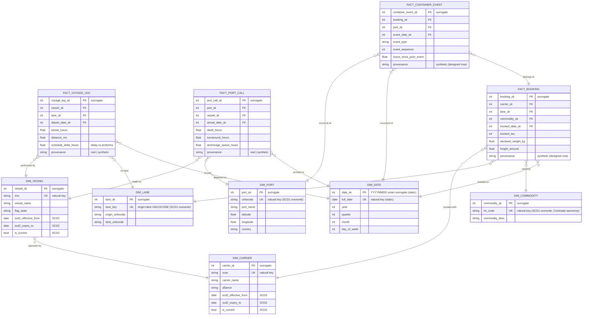

# M2 Deck Source — BigQuery Star Schema (MOD-03, MOD-04)

> **Manual step:** This file is the repo-side source of truth. Placing this content onto the M2 "BigQuery Star Schema" slide in the shared Google Slides deck is a manual copy-paste step — do not create a new deck.

The physical OLAP model is a **star schema** on BigQuery native tables: four fact tables surrounded by six conformed dimensions, each fact stated as a single-sentence grain and each dimension assigned an explicit slowly-changing-dimension (SCD) strategy. The star-over-snowflake choice is defended separately in `m2-star-vs-snowflake.md` (MOD-05).

## Fact Grains (MOD-03)

Each fact has exactly one grain — one row per the unit named below. Two grains are the implemented-design grains carried forward verbatim (D-01, D-02); the other two are designed now and implemented later (D-03).

- **`fact_voyage_leg` (D-01)** — one row per vessel per consecutive port-to-port leg (AIS-derived): a vessel departing port A and arriving at port B. *Measures:* transit hours, distance, schedule delta (delay vs proforma). This is the implemented-slice fact (AIS → `fact_voyage_leg`) and the UC1 (ETA reliability) source, grounded in real AIS ground truth.
- **`fact_port_call` (D-02)** — one row per vessel call at a port, spanning arrival → departure. *Measures:* dwell hours, turnaround, anchorage/queue time. This is the UC2 (congestion/dwell) source. (A daily port-snapshot rollup, if needed, is a *derived* aggregate, not the base fact.)
- **`fact_booking` (D-03, designed now / implemented later)** — one row per shipment booking accepted by the forwarder. *Measures:* booked TEU/containers, declared weight, freight amount; carries `commodity_sk` (HS-code), `lane_sk`, `carrier_sk`. Synthetic; modeled now to carry the forwarder-internal transactional story.
- **`fact_container_event` (D-03, designed now / implemented later)** — one row per container per status event (e.g. gate-in, loaded, discharged, gate-out) on a booking. *Measures:* event timestamp/duration since prior event, event sequence. Synthetic; the finest-grain event stream hanging off `fact_booking`.

## Conformed Dimensions & SCD Strategy (MOD-04, D-04/D-05)

History is tracked only where a dimension's attributes change meaningfully; reference dimensions are overwritten. The SCD-type mapping is carried forward verbatim from D-04, with the SCD2 change triggers from D-05.

### SCD Type 2 — history-tracked dimensions

- **`dim_vessel` (SCD2)** — spawns a new version on **operator/owner change, name change, or flag-state change** (D-05). Natural key `imo`.
- **`dim_carrier` (SCD2)** — spawns a new version on **alliance-membership change or rebrand/merger** (D-05). Natural key `scac`.

These are realistic maritime change events and form the dimensional-modeling defense narrative. An SCD2 row carries the column convention **`scd2_effective_from DATE`, `scd2_expiry_to DATE`, `is_current BOOL`** alongside its natural business key (`imo` / `scac`). A change to a tracked attribute closes the current row (`scd2_expiry_to` set, `is_current=false`) and inserts a fresh current row with a new surrogate key.

### SCD Type 1 — overwrite-in-place dimensions

- **`dim_port` (SCD1, overwrite)** — natural key `unlocode`. No effective/expiry columns; attribute changes overwrite in place.
- **`dim_lane` (SCD1, overwrite)** — natural key = port-pair (origin + destination UN/LOCODE).
- **`dim_commodity` (SCD1, overwrite)** — **HS-code taxonomy sourced from UN Comtrade, assigned to synthetic bookings** (resolves the Claude's-Discretion sourcing item). Natural key = HS code.

### Static dimension

- **`dim_date` (static / immutable)** — generated once, never versioned or overwritten.

### Deferred (D-06)

**SCD2-on-`dim_port` is deferred to v2 / WHX-02 (extra credit).** Phase 2 designs `dim_port` as SCD Type 1; the SCD2-on-port story stays explicitly future/extra-credit, not part of the M2 implemented design.

### Surrogate-key convention

Every dimension carries an `INT64` surrogate primary key named `<dim>_sk` (e.g. `port_sk`, `vessel_sk`, `carrier_sk`) **plus a separate non-null natural business key column** (`unlocode`, `imo`, `scac`, HS code). Facts carry the surrogate FKs. The natural key — distinct from the surrogate — is the column that bridges to the ArangoDB `_key` (see `m2-conformed-keys.md`, MOD-07).

## Partition & Cluster (MOD-03)

Facts use **BigQuery native tables (not external)**: external tables read from GCS at query time and are slower; the served star is loaded once into native storage.

Fact tables are **integer-range partitioned on their `*_date_sk` column** — `depart_date_sk` (`fact_voyage_leg`), `arrival_date_sk` (`fact_port_call`), `booked_date_sk` (`fact_booking`), `event_date_sk` (`fact_container_event`). Each is the `YYYYMMDD`-encoded smart surrogate key from `dim_date`, so a date-range predicate prunes partitions directly. Because the dataset is bounded to one region / quarter (CLAUDE.md scope), daily partitions stay well within BigQuery's 10,000-partition cap; partition pruning is the single biggest cost lever for the temporal use cases (ETA reliability, congestion over time). *(If the window later widens past the cap, the fallback is a physical `DATE` partition column per fact with `PARTITION BY` on it.)*

Facts are **clustered on ≤4 high-selectivity foreign keys, specified per fact** (a generic three-key list is not realizable — no single fact carries all of `port_sk`/`carrier_sk`/`vessel_sk`): `fact_voyage_leg` on `vessel_sk, lane_sk`; `fact_port_call` on `port_sk, vessel_sk`; `fact_booking` on `carrier_sk, lane_sk`; `fact_container_event` on `booking_sk, port_sk`.

## Physical Star (Mermaid)

---

*MOD-03 satisfied: BigQuery star with a one-sentence grain per fact and six conformed dimensions, partitioned + clustered native tables. MOD-04 satisfied: SCD2 on `dim_vessel`/`dim_carrier` (with triggers), SCD1 on `dim_port`/`dim_lane`/`dim_commodity`, static `dim_date`; SCD2-on-port deferred to v2 / WHX-02.*
