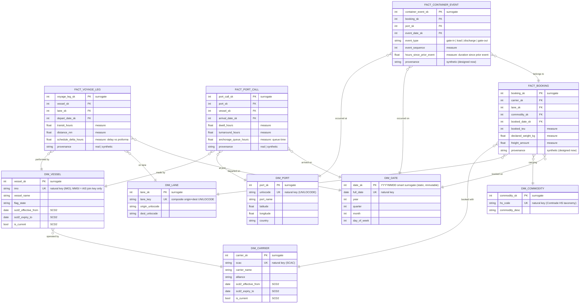

# M2 Deck Source — ER Diagram & Fact/Dimension Classification (MOD-01, MOD-02)

> **Manual step:** This file is the repo-side source of truth. Placing this content onto the M2 "ER Diagram" slide in the shared Google Slides deck is a manual copy-paste step — do not create a new deck.

The logical ER model for the Ocean Freight Forwarder architecture. The entity set, fact grains, and conformed dimensions are carried forward **verbatim** from `02-CONTEXT.md` (D-01..D-03) and are not re-decided here. The locked set is **4 facts + 6 dimensions = 10 entities**, comfortably clearing the MOD-01 5–6-entity bar. Star-vs-snowflake (MOD-05) and SCD strategy (MOD-04) are addressed in `m2-bq-star.md`, not here. Fact-vs-dimension classification (MOD-02) is encoded by the `fact_*` / `dim_*` naming prefix and made explicit in the companion table below (Mermaid color is deliberately not relied upon, per the research anti-pattern note — GitHub's renderer drops some styling).

## Logical ER Diagram (MOD-01)

Notes on the diagram (Pattern D decision-ID annotations):

- **`FACT_VOYAGE_LEG` (D-01):** one row per vessel per consecutive port-to-port leg (AIS-derived); measures `transit_hours`, `distance_nm`, `schedule_delta_hours` (delay vs proforma). This is the **implemented-slice** fact (AIS → `fact_voyage_leg`) and the UC1 (ETA reliability) source.
- **`FACT_PORT_CALL` (D-02):** one row per vessel call at a port (arrival → departure); measures `dwell_hours`, `turnaround_hours`, `anchorage_queue_hours`. UC2 (congestion/dwell) source.
- **`FACT_BOOKING`, `FACT_CONTAINER_EVENT` (D-03):** synthetic facts **designed now, implemented later** — present in the model so all four use cases hang off a coherent ER, but only `fact_voyage_leg` is built in the Phase-5 ETL slice.
- **`DIM_VESSEL }o--|| DIM_CARRIER : "operated by"` (D-03 / Phase-1 D-10):** vessel→carrier operator links are synthetic/reference-assigned (AIS carries no operator field).
- Every fact carries a `provenance "real | synthetic"` attribute (Phase-1 D-14). Surrogate PKs are `<entity>_sk`; natural business keys are marked `UK` (`unlocode`, `imo`, `scac`, `hs_code`) — these are the conformed keys that bridge to ArangoDB `_key`s (MOD-07, documented in `m2-conformed-keys.md`).

## Fact vs Dimension Classification (MOD-02)

Classification is by naming prefix (`fact_*` / `dim_*`) plus the table below — not Mermaid color.

| Entity | fact \| dimension | Grain / role |
|--------|-------------------|--------------|
| `fact_voyage_leg` | fact | One row per vessel per consecutive port-to-port leg, AIS-derived (D-01). UC1 source; the implemented Phase-5 slice. |
| `fact_port_call` | fact | One row per vessel call at a port, arrival → departure (D-02). UC2 source. **Designed now, implemented later (D-03).** |
| `fact_booking` | fact | One row per shipment booking with a carrier on a lane (D-03). **Designed now, implemented later (D-03).** |
| `fact_container_event` | fact | One row per container milestone event (gate-in/load/discharge/gate-out) within a booking (D-03). **Designed now, implemented later (D-03).** |
| `dim_date` | dimension | Conformed calendar dimension; static/immutable (generated). Shared by every fact. |
| `dim_port` | dimension | Conformed port reference, keyed by UN/LOCODE; geo + harbor attributes. |
| `dim_vessel` | dimension | Conformed vessel reference, keyed by IMO (MMSI = AIS join key only). |
| `dim_carrier` | dimension | Conformed carrier reference, keyed by SCAC; ~10–15 major ocean liners. |
| `dim_lane` | dimension | Conformed origin→destination port-pair lane; the warehouse twin of the graph `route`/`segment` edge. |
| `dim_commodity` | dimension | Conformed commodity reference (Comtrade HS-code taxonomy), assigned to synthetic bookings. |

Only `fact_voyage_leg` is implemented in the Phase-5 ETL slice; `fact_port_call`, `fact_booking`, and `fact_container_event` are **designed now, implemented later (D-03)** — they enrich the ER past the 5–6-entity bar and carry the `real | synthetic` provenance narrative while staying honest about what is built.

---

*MOD-01 / MOD-02 satisfied: 10-entity ER diagram (4 facts + 6 dims) with annotated relationships and a fact/dim classification of every entity.*
