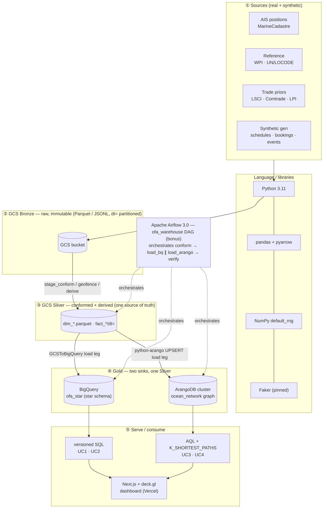

# Tech-Stack Diagram — Ocean Freight Forwarder Data Architecture

> For slide F-8. The **Mermaid** version renders on GitHub and in most slide tools; the **ASCII**
> version is the copy-paste fallback for Google Slides. Per-tool justification + alternatives are in
> the sibling files in this folder.

## Mermaid (layered, source → product)



## ASCII fallback (for Google Slides)

```
                            ┌──────────────── Apache Airflow 3.0 (bonus) ────────────────┐
                            │   ofa_warehouse DAG: conform → load_bq ∥ load_arango → verify
                            ▼                                                            ▼
 ① SOURCES            ② GCS BRONZE          ③ GCS SILVER              ④ GOLD                ⑤ SERVE / CONSUME
 ─────────            ─────────────         ──────────────            ───────────           ─────────────────
 AIS positions  ┐                           MMSI→IMO resolve     ┌─▶ BigQuery star  ─▶ SQL (UC1/UC2) ┐
 WPI/UN-LOCODE  ├─▶ raw, immutable    ─────▶ GEO-FENCE→calls,    │   (partition+cluster)             ├─▶ Next.js
 LSCI/Comtrade  │   Parquet + JSONL          derive voyage-legs, │                                    │   dashboard
 /LPI priors    │   dt= partitioned          EDGE WEIGHTS from   └─▶ ArangoDB graph ─▶ AQL +         │   (deck.gl,
 synthetic gen  ┘                            priors, conform keys    ocean_network    K_SHORTEST_PATHS┘   Vercel)
                                             + provenance flag                            (UC3/UC4)

   built with: Python 3.11 · pandas + pyarrow · NumPy default_rng · Faker (pinned) · python-arango
```

## Reading the diagram (one sentence)

Real + synthetic sources land **as-is** in GCS Bronze; one **conform/geo-fence/derive** step builds
the Silver source-of-truth; **two parallel load legs** project that *same* Silver into a BigQuery
star (OLAP) and an ArangoDB graph (network); the four use cases are answered as **versioned SQL/AQL**
and surfaced in a **Next.js dashboard** — with **Airflow** orchestrating the whole thing (bonus).
